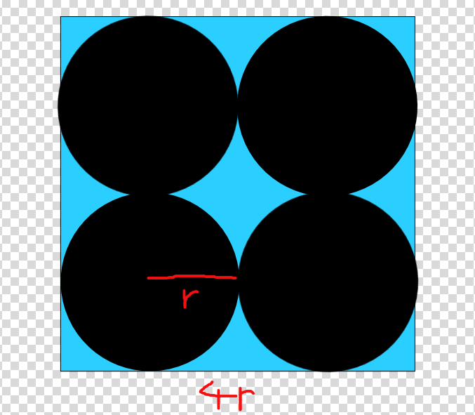

# Ympyrät ja neliö

*2. heinäkuuta 2026*

Tutkitaan neliötä, jonka peitää neljä yhtäsuurta ympyrää.

Lasketaan kuinka suuren osan neliön pinta-alasta ympyrät peittävät.

$$\frac{4\pi r^2}{(4r)^2}$$

$$\frac{4\pi r^2}{16r^2}$$

$$\frac{\pi}{4}$$

!!! success "Vastaus"
    Ympyröiden suhde neliön pinta-alaan on $\dfrac{\pi}{4}$.
